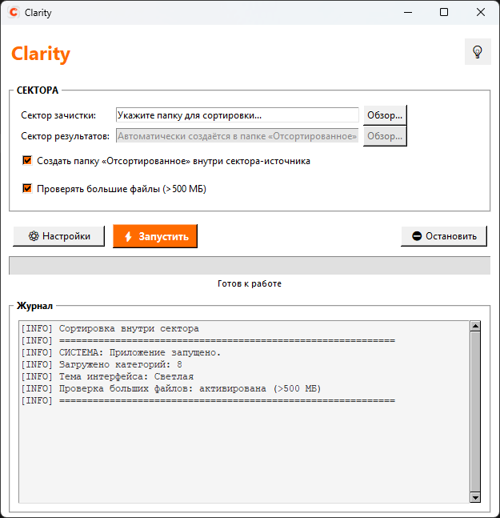
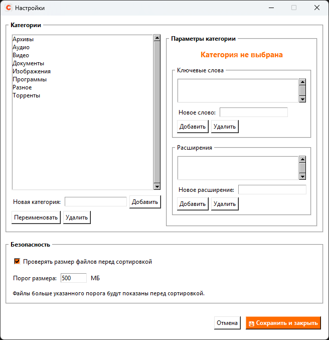
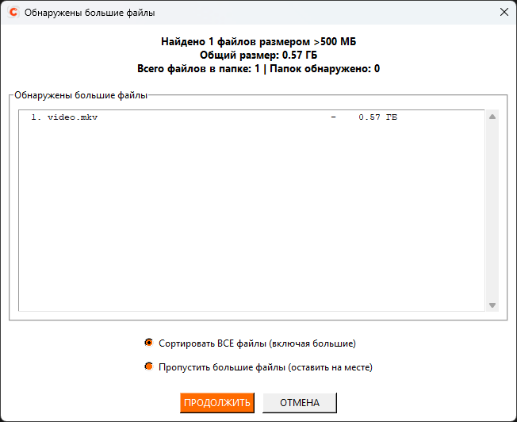

# ClaritySort

**ClaritySort** — настольное приложение для автоматической сортировки файлов по настраиваемым категориям.  
Позволяет в несколько кликов навести порядок в папках: документы, изображения, видео, архивы и другие файлы распределяются по папкам в соответствии с заданными правилами.

> В интерфейсе программа отображается под коротким именем **Clarity**.

[](https://opensource.org/licenses/MIT)
[](https://www.python.org/downloads/)
[](https://github.com/ClaritySort/ClaritySort/releases/latest)
[](https://github.com/ClaritySort/ClaritySort/releases)

[English version](README_EN.md)

---

## ⚠️ Отказ от ответственности

**Используйте программу осознанно, на свой страх и риск.** ClaritySort перемещает файлы в соответствии с правилами, которые вы задаёте в настройках. Разработчики **не гарантируют** отсутствие ошибок в классификации, в работе ОС или оборудования и **не несут ответственности** за потерю, повреждение или недоступность данных.

**Перед сортировкой обязательно сделайте резервную копию** важных каталогов. В приложении **нет** встроенного бэкапа и **нет** отката выполненных перемещений.

---

## ✨ Возможности

- 🎯 **Гибкие категории** — для каждой категории можно задать расширения файлов и ключевые слова (поиск в имени). Ключевые слова имеют приоритет.
- ⚙️ **Настройка через интерфейс** — добавление, удаление, переименование категорий, управление ключевыми словами и расширениями.
- 📦 **Проверка больших файлов** — перед сортировкой показывается список файлов > заданного порога (по умолчанию 500 МБ). Можно переместить их или пропустить.
- 📋 **Детальное логирование** — каждая операция сохраняется в JSON-журнал (`data/logs`). В главном окне — текстовый лог с возможностью копирования.
- 🌓 **Две темы** — светлая и тёмная, переключение в один клик.
- 💾 **Сохранение настроек** — все правила, тема, параметры безопасности автоматически сохраняются в `data/config.json`.
- 🔄 **Обработка дубликатов** — при совпадении имён создаются копии `(1)`, `(2)` и т.д.
- 🖥️ **Кроссплатформенность** — работает на Windows, Linux, macOS (Python 3 + Tkinter).

> ⚡ **Важно:** если одно расширение указано в нескольких категориях, применяется **последнее** совпадение по порядку категорий в конфиге. Старайтесь не дублировать расширения.

---

## 🌐 Язык интерфейса

По умолчанию язык определяется автоматически: если система русская — интерфейс на русском, иначе на английском.

Чтобы **принудительно задать язык** (например, английский на русской системе):

1. Откройте файл `main.py`.
2. Найдите строку:
   FORCE_APP_LANG = None
3. Замените `None` на `"en"` или `"ru"`.
4. Сохраните файл и перезапустите программу.

Альтернативно можно установить переменную окружения:

set CLARITY_LANG=en

---

## 📸 Скриншоты

### Главное окно


### Окно настроек категорий


### Диалог проверки больших файлов


---

## 🚀 Установка и запуск

### 📦 Репозитории

- **GitHub:** https://github.com/ClaritySort/ClaritySort
- **GitVerse:** https://gitverse.ru/ClaritySort/ClaritySort

---

### 👨‍💻 Для разработчиков (из исходного кода)

1. Убедитесь, что установлен **Python 3.9 или выше**.
2. Склонируйте репозиторий:

# GitHub
git clone https://github.com/ClaritySort/ClaritySort.git

# GitVerse
git clone https://gitverse.ru/ClaritySort/ClaritySort.git

cd ClaritySort

3. Запустите программу:

python main.py

Дополнительные зависимости не требуются — только стандартная библиотека и Tkinter.

---

### 🧑‍💻 Для обычных пользователей (Windows)

Скачайте готовый исполняемый файл **ClaritySort.exe**:  
[**Скачать последнюю версию**](https://github.com/ClaritySort/ClaritySort/releases/latest/download/ClaritySort.exe)  
*(Установка не требуется — просто запустите скачанный файл.)*

---

## 📚 Краткое руководство

### 1. Выбор папок

- **Сектор зачистки** — папка с файлами для сортировки.
- **Сектор результатов** — папка, куда будут перемещены файлы.

Если включена опция **«Создать папку внутри сектора-источника»**, подпапка *Отсортированное* (или *Sorted*) создастся автоматически, а поле выбора цели заблокируется.

---

### 2. Настройка категорий

Нажмите **«⚙️ Настройки»**.

В левой части — список категорий. Вы можете:
- добавить категорию
- переименовать
- удалить (кроме служебной «Разное»)

Для выбранной категории настраиваются:

- **Ключевые слова** — приоритетнее расширений  
- **Расширения файлов** (например, `.pdf`, `.jpg`)

---

### 3. Безопасность

В разделе «Безопасность» окна настроек можно:

- включить/выключить проверку размера файлов
- задать порог в мегабайтах (1–102400 МБ)

При включённой проверке перед стартом появится диалог со списком больших файлов.

---

### 4. Запуск и остановка

- Нажмите **«⚡ Запустить»**
- Прогресс отображается на индикаторе
- Кнопка **«⛔ Остановить»**:
  - прерывает сканирование больших файлов
  - или останавливает сортировку после текущего файла

---

### 5. Логи

- В главном окне доступен текстовый журнал
- Полный JSON-отчёт сохраняется в:

data/logs/sort_YYYY-MM-DD_HH-MM-SS.json

Хранятся последние **50 файлов логов**.

---

## 📁 Структура проекта

```text
ClaritySort/
├── core/                     # Ядро приложения
│   ├── config_manager.py
│   ├── localization.py
│   ├── operation_logger.py
│   ├── paths.py
│   ├── sorter_engine.py
│   └── utils.py
├── ui/                       # Графический интерфейс (Tkinter)
│   ├── main_window.py
│   ├── settings_window.py
│   └── theme_styles.py
├── data/                     # Пользовательские данные (создаётся при первом запуске)
│   ├── config.example.json   # Пример конфигурации
│   └── logs/                 # Журналы операций
├── screenshots/              # Изображения для документации
├── packaging/                # Файлы для сборки
├── main.py                   # Точка входа
├── app_icon.ico              # Иконка приложения
├── README.md
├── README_EN.md
├── LICENSE
└── requirements.txt
```
---

## 🔧 Сборка в EXE (Windows)

Если вы хотите самостоятельно собрать исполняемый файл:

1. Установите PyInstaller:

pip install pyinstaller

2. Выполните команду из корня проекта:

pyinstaller --onefile --windowed --icon=app_icon.ico --add-data "data;data" --manifest packaging/app_long_paths.manifest main.py

Для Linux/macOS:
- замените `;` на `:`
- уберите `--manifest`, если не используется

Готовый EXE появится в папке `dist/`.  
Рекомендуется переименовать его в **ClaritySort.exe**.

---

## 📄 Лицензия

Проект распространяется под лицензией **MIT**.  
Полный текст — в файле `LICENSE`.

---

## 💖 Поддержать проект

Если программа оказалась полезной, вы можете поддержать разработку через Boosty:  
[](https://boosty.to/claritysort/donate)

Любая поддержка мотивирует развивать проект дальше!

---

## 🙏 Благодарности

Это мой первый опыт создания десктопного приложения на Python. В процессе разработки активно использовались современные инструменты, включая нейросетевые помощники, что помогло ускорить написание кода, отладку и подготовку документации.

Спасибо open-source сообществу за знания и вдохновение.

---

## 📬 Обратная связь

Если у вас есть идеи, пожелания или вы нашли ошибку — [создайте Issue](https://github.com/ClaritySort/ClaritySort/issues) или напишите в [обсуждениях](https://github.com/ClaritySort/ClaritySort/discussions).  
Буду рад любым отзывам и предложениям!

---

© 2026 ClaritySort
